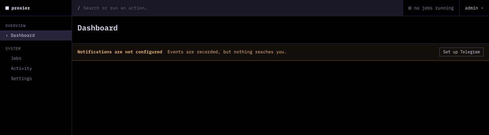
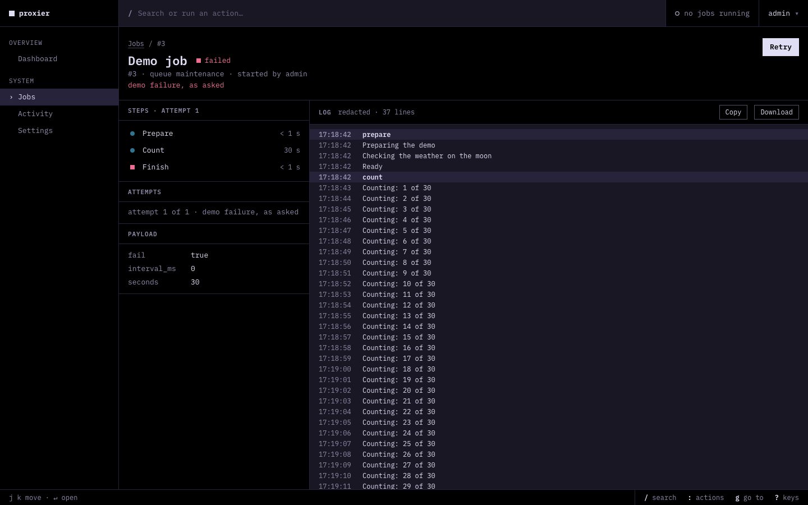
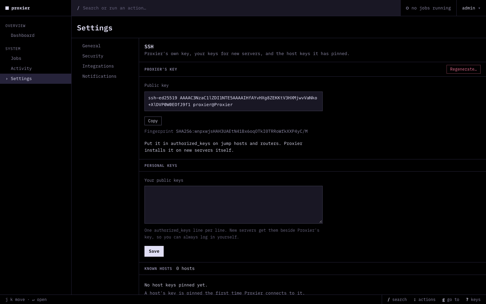

# Proxier

A self-hosted control panel for one person's proxy setup. It is meant to build proxy servers from versioned templates and watch whether they work from Russia, give people and devices subscription links, keep domain routing on MikroTik routers and the Shadowrocket config in sync, and host the router setup script. One Go binary, one SQLite file, a server-rendered web UI (templ + htmx) in English and Russian.



## Status

The platform that everything else stands on is built: sign-in and sessions, settings, the secret vault, background jobs with live logs and a scheduler, the event history, Telegram notifications, an SSH client with pinned host keys, an optional tailnet node, nightly backups, and the UI shell. The proxy-server, subscription, routing and router-script modules are designed (see the docs) and are being built phase by phase; see [the roadmap](docs/roadmap.md).

## Screenshots

A job page with its steps and live log (a demo job that fails on purpose):



Settings, SSH: Proxier's own key and the host keys it has pinned:



## Documentation

Start at [docs/README.md](docs/README.md): the overview, architecture, decisions (ADRs), data model, per-module docs and process docs.
## Development

```sh
make test     # go test -race ./...
make check    # templ generate, gofmt, vet, generated-file diff, tests
make dev      # docker compose with hot reload on :8080 (needs .env, see .env.example)
```

## License

AGPL-3.0, see [LICENSE.md](LICENSE.md).
