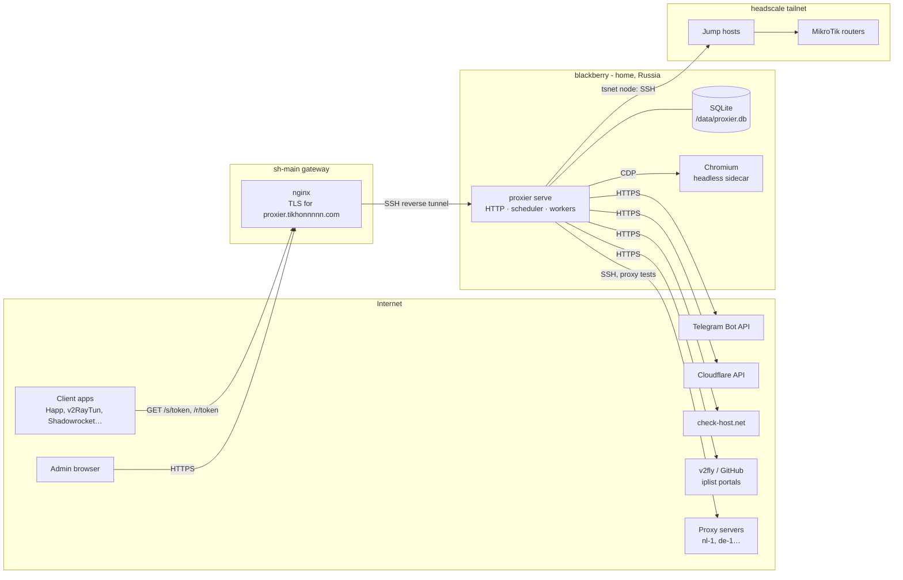

# Architecture

## Runtime shape

Proxier is **one Go binary** (`proxier`) in one container, with its data in one SQLite file ([ADR 0001](./adr/0001-single-binary-sqlite-in-process-jobs.md)). It runs on blackberry. A headless Chromium sidecar is used only by discovery. `proxier serve` runs the HTTP server, the scheduler and every worker pool in one process. `proxier manage …` holds the one-off admin commands (create the admin, reset the password, run migrations, back up).



Proxier makes every outbound connection from home, so its checks see the Russian network ([ADR 0005](./adr/0005-home-is-the-russian-vantage-point.md)). Home has a MikroTik with selective VPN routing, so one rule matters everywhere: **traffic from Proxier to its servers must never enter the router's VPN**. Otherwise the proxy test measures the tunnel, not the Russian path. Proxier refuses routing lists that cover a server's hostname ([routing lists](./processes/routing/routing-lists.md)).

## Platform and modules

The code is a **platform** plus **modules** ([ADR 0002](./adr/0002-modules-talk-through-ports-and-events.md)). Modules are Go packages compiled in, not runtime plugins. A module is enabled by being registered in `main`. Removing it from that list removes its pages, jobs and tables from use, and the modules that depend on it hide the features that needed it.

The platform provides: the HTTP server and its middleware (session, CSRF, rate limits, i18n), settings, the secret vault, the job system and scheduler, the event log and dispatcher, notification channels, the SSH client (jump hosts, pinned host keys), the tailnet node, and the shared UI shell (layout, navigation, components).

Each module registers, at startup:

| Registration | Example (servers) |
|---|---|
| Migrations for its own tables, with its own version table | `servers_*` tables |
| Admin routes and public routes | `/servers/...`; subscriptions owns `/s/{token}` |
| Navigation entries and dashboard widgets | "Servers", fleet health widget |
| Job types: the queue, the resource key, retry policy, steps | `servers.provision` on queue `provisioning` |
| Schedules (periodic jobs) with defaults that Settings can change | self-check every 5 min |
| Event types it records, with default notification on/off and message text | `server.health_changed` |
| Event subscriptions (reactions to other modules' events) | subscriptions reacts to `server.retired` |
| Settings sections | Health thresholds |
| Translations (EN, RU) | `servers.*` keys |
| Ports it provides to other modules | `EndpointCatalog`, `ProxyDialer` |

**Ports** are small Go interfaces a module exports for others to call synchronously. Today's ports:

| Port | Provided by | Used by | What it does |
|---|---|---|---|
| `EndpointCatalog` | servers | subscriptions | List active servers, their endpoints, connection URI parts and current health state. |
| `Rotator` | servers | subscriptions | The rotation job of a server, for a cut-off to queue in its own transaction (one server at a time). |
| `ServerHostnames` | servers | routing | Every non-retired server with its name and management and proxy hostnames, which must never be routed (the guard names the server). |
| `RoutingGuard` | routing | servers (provisioning) | Which of a new server's hostnames a routing list covers, naming the list and the service, so the form refuses them. |
| `ProxyDialer` | servers | routing (discovery) | Open connections through a chosen server's endpoint: `Dial(ctx, serverID)` returns a `servers.DialFunc` (a func type of the servers root package, so routing imports nothing else of servers) and a closer. Discovery puts its own per-run SOCKS listener in front of it. |
| `LinkIssuer` | subscriptions | router scripts | Create a link in a subscription and return its URL. |
| `RouterRegistrar` | routing | router scripts | Register a router (in "awaiting setup") with a routing list, a connection and names. Return the address-list and DoH-forwarder names. |

A port's consumer handles its absence: no subscriptions module means router scripts don't offer "create a link".

**Events** carry the asynchronous reactions (below). A module never reads another module's tables.

### Extension points

These are pluggable in code: an interface plus a registry. Adding one is a new Go file, not a change to the module.

| Module | Extension point | First implementations | Later candidates |
|---|---|---|---|
| Servers | Endpoint type: builds connection URIs, tests a connection, validates params | `vless-xhttp-tls` | VLESS Reality, Hysteria2, Trojan |
| Servers | Step kind (template steps) | `base-bootstrap`, `upload-files`, `run`, `compose-up`, `compose-down`, `wait-http` | `apt-upgrade`, `reboot` |
| Servers | Self-check kind | `compose-running`, `http-local`, `cert-expiry`, `disk-free`, `run` | — |
| Servers | File validator | `xray`, `compose`, `nginx`, `json`, `yaml`, `shell` | `caddy`, `sing-box` |
| Servers | Generated-value kind | `uuid`, `hex`, `base64`, `password` | `x25519` (Reality keys) |
| Servers | DNS provider | Cloudflare | deSEC, Hetzner DNS |
| Servers | External checker | check-host.net | Globalping, probe agents |
| Subscriptions | Format | `uri-plain`, `uri-base64` | mihomo YAML, sing-box JSON, browser page |
| Routing | Source | `v2fly`, `iplist`, `url`, `custom` | antifilter, community lists |
| Routing | Target kind | `mikrotik`, `shadowrocket` | mihomo rule-provider, sing-box rule-set, plain list URL |
| Routing | Discovery method | catalog lookup, headless visit | HAR import, crt.sh subdomains, router DNS-cache learning |
| Platform | Notification channel | Telegram | ntfy, email, webhook |

## Jobs

All long or remote work runs as **jobs** stored in SQLite, so they survive restarts, can be retried and cancelled, and show a live log ([ADR 0001](./adr/0001-single-binary-sqlite-in-process-jobs.md), [jobs process](./processes/platform/jobs.md)).

- **Queues** each have a worker pool with fixed concurrency:

  | Queue | Jobs | Concurrency |
  |---|---|---|
  | `provisioning` | provision, redeploy, upgrade, rotate, restart stack, update images, retire | 2 |
  | `checks` | self-check + stats, proxy test, external check, reference check | 8 |
  | `routers` | router sync, drift check, connection test | 2 |
  | `refresh` | upstream refresh, catalog refresh and index | 2 |
  | `discovery` | discovery run | 1 |
  | `notify` | Telegram delivery | 1 |
  | `maintenance` | backups, retention cleanup, expiry scan, shared-link scan | 1 |

- **States**: `queued` → `running` → `succeeded` | `failed` | `cancelled`. `interrupted` is recorded when a restart cut a job short.
- **Steps**: a job is a sequence of named steps. Step state is stored, the UI shows progress per step, and an interrupted or retried job resumes from the first step that didn't finish. Every step is written so that running it twice is harmless.
- **Resource key**: at most one running job per key (`server:12`, `router:3`). Others with the same key wait in the queue. Health checks skip a server whose resource key is busy with a mutating job.
- **Coalescing key**: enqueueing a job whose coalescing key matches a queued (not yet running) job merges into it, but only if that job has never started. If the matching job is running (or has started and waits for a retry), exactly one follow-up is queued, and further requests merge into the follow-up. Router syncs use this, so adding five services in a minute causes one sync, not five.
- **Delay**: jobs can be queued to run after a moment. Router syncs wait 30 s after the triggering change, to gather more changes.
- **Retries**: each job type declares attempts and backoff, e.g. a router sync tries 4 times (5 min, 15 min, 1 h).
- **Cancellation**: a queued job is cancelled at once. A running job gets a cancel request, and its handler stops at the next step boundary (or inside a step that supports it).
- **Logs**: each job has an ordered log (time, level, step, line), streamed live to the UI. **Redaction**: every secret value the job knows (passwords, generated values, tokens) is replaced with `•••` before a line is stored or shown.
- **Scheduler**: periodic jobs are declared by modules (name, default interval or time of day, jitter). It enqueues them and never runs two of the same schedule at once.

## Events and history

Every state change records an **event** in the same transaction as the change ([events catalog](./events.md)): time, module, type, subject (`server:12`), actor (`admin`, `system`, `job:<id>`), and a payload. Events are append-only and are the activity history.

A **dispatcher** delivers committed events to subscribers after the commit: other modules' reactions, and the notifier. Delivery is at least once, tracked by a cursor per subscriber. A handler runs inside the write transaction that advances its cursor, so a reaction that only writes locally happens exactly once; any other handler must be idempotent. A subscriber seen for the first time starts at the newest event. Nothing slow or remote happens inside a transaction: a reaction that needs the network enqueues a job.

## Reconciliation

Servers and targets follow one pattern: Proxier holds the **desired state**, remembers the **applied state**, and a job makes reality match:

| Thing | Desired | Applied record | Applied by |
|---|---|---|---|
| Server stack | Template version + parameters + generated values, rendered | Rendered files of the last successful deployment | redeploy |
| Router | Per tag: the domains the routing list gives it | Per tag: domain hash and counts installed | router sync |
| Shadowrocket config | Base config + routing list rules | Rendered on request | (no remote side) |
| Subscription output | Subscription servers, their endpoints and health | Computed on every fetch | (no remote side) |

Comparing desired with applied gives a **plan**. The admin can preview the plan before it runs (redeploy diff, router sync preview), and the job only touches what differs.

## Data

- **SQLite** in WAL mode, one file on the `/data` volume, opened by the one process. Writes go through one connection, reads through a small pool ([ADR 0001](./adr/0001-single-binary-sqlite-in-process-jobs.md)).
- **Tables are owned by modules** and prefixed by module (`servers_`, `subs_`, `routing_`, `rscripts_`, platform without a prefix). Each module has its own migrations and migration-version table.
- **No foreign keys across modules.** A row may hold another module's ID, but cleanup happens by event. For example, `server.retired` makes subscriptions drop the server from every subscription ([ADR 0002](./adr/0002-modules-talk-through-ports-and-events.md)). Foreign keys inside a module are normal.
- **Secrets are encrypted at rest** with AES-256-GCM under a master key from the environment ([ADR 0012](./adr/0012-secrets-encrypted-root-password-never-stored.md)). Lookups by secret (link tokens) use an HMAC of the token, never the token itself.
- Full entity list: [data-model.md](./data-model.md).

## HTTP surfaces

One listener, two kinds of routes. The namespaces are fixed so the gateway can later split them across hosts without a code change ([ADR 0006](./adr/0006-one-public-host-for-admin-and-public-urls.md)).

| Prefix | Who | Auth | Purpose |
|---|---|---|---|
| `/login`, `/logout` | admin | — | Sign-in |
| `/` (everything else) | admin | session cookie + CSRF | The admin UI |
| `/s/{token}` | client apps | token | Link output ([fetch](./processes/subscriptions/subscription-fetch.md)) |
| `/r/{token}/{name}.conf` | Shadowrocket | token | Hosted Shadowrocket config |
| `/f/{token}` | a router | single-use token | Router script fetch URL |
| `/healthz` | monitoring | — | Liveness (DB reachable, workers alive). Reveals nothing. |

Public routes never set cookies, always send `Cache-Control: no-store` and `X-Robots-Tag: noindex`. `/s/`, `/r/` and `/f/` are rate-limited to 60 requests a minute per client IP (a fixed window; over it, `429` with `Retry-After`); `/agent/` limits itself per session. All unknown tokens get the same plain `404` as any unknown public path. Proxier's own logs never hold a token: the request log and the error log write `/s/•••`, `/r/•••/home.conf`. The client IP comes from `X-Real-IP` only when the request arrives from a trusted proxy address (the SSH tunnel endpoint). Otherwise it is the socket address.

## Outbound connections

| To | Why | How |
|---|---|---|
| Proxy servers | provisioning, redeploys, self-checks, stats | SSH (key, pinned host key) |
| Proxy servers | proxy tests, discovery through a server | embedded xray-core client ([ADR 0009](./adr/0009-embedded-xray-core-no-docker-socket.md)) |
| Routers (via jump hosts) | sync, drift checks | SSH over the embedded tailnet node ([ADR 0008](./adr/0008-tsnet-node-for-router-reachability.md)) |
| Cloudflare API | DNS records | HTTPS, API token |
| check-host.net | external checks | HTTPS API |
| Telegram Bot API | notifications | HTTPS |
| raw.githubusercontent.com, api.github.com, codeload.github.com | v2fly lists, catalog, reverse index | HTTPS |
| iplist portals (main, beta, russia) | iplist lists and catalog | HTTPS |
| Public DNS resolvers (1.1.1.1, 8.8.8.8) | DNS propagation wait | DNS / DoH |
| IP country lookup (`https://ipinfo.io/{ip}/country` by default) | the location suggested for a new server (its IP); the country of each network that fetched a link (the network's first address, never the person's own; once a month per network) | HTTPS; settings `servers.ip_country_url`, `subscriptions.network_country_url` (empty turns each off) |
| Reference sites (one domestic, one foreign) | reference checks | HTTPS |

## Security model (summary)

- One admin, password sign-in on a public host, no 2FA yet. Mitigations: login lockout per IP, a notification on sign-in from a new IP, short idle sessions, secure cookies, CSRF on every change ([sign-in](./processes/platform/sign-in.md)).
- Secrets encrypted at rest. The root password of a new VPS is kept, encrypted, only until Proxier's key is installed, then erased ([ADR 0012](./adr/0012-secrets-encrypted-root-password-never-stored.md)).
- SSH host keys are pinned on first contact. A changed key stops all work with that host until the admin accepts the new key ([ADR 0007](./adr/0007-agentless-ssh-with-pinned-host-keys.md)).
- Proxier never gets the Docker socket of the machine it runs on ([ADR 0009](./adr/0009-embedded-xray-core-no-docker-socket.md)).
- Tokens are long (≥ 128 bits), random, compared through HMAC lookups, and regenerable.
- Job logs and UI never show a secret unless the admin explicitly reveals it.

## Observability

- Structured JSON logs (`log/slog`) to stdout. Dozzle on blackberry shows them.
- Job history, the event log and check results inside Proxier are the operational record.
- `/healthz` for container health checks.

## Configuration

Environment variables hold what's needed before the database is readable, plus anything that is easier to keep in the `secrets/` submodule. Everything else is in Settings (stored, secrets encrypted).

| Variable | Meaning | Default |
|---|---|---|
| `PROXIER_DATA_DIR` | Database, tailnet state, backups | `/data` |
| `PROXIER_MASTER_KEY` | 32-byte key (base64) that encrypts every secret. Losing it loses the secrets. | required |
| `PROXIER_LISTEN` | HTTP listen address | `:8080` |
| `PROXIER_BASE_URL` | Public base URL for admin and public routes | required, e.g. `https://proxier.tikhonnnnn.com` |
| `PROXIER_TRUSTED_PROXIES` | Addresses whose `X-Real-IP` is believed | the tunnel's address |
| `PROXIER_TS_CONTROL_URL` | headscale URL for the tailnet node | `https://hs.tikhonnnnn.com` |
| `PROXIER_TS_AUTHKEY` | Pre-auth key for the first tailnet login | empty: tailnet off |
| `PROXIER_TS_HOSTNAME` | Tailnet node name | `proxier` |
| `PROXIER_CHROMIUM_URL` | CDP endpoint of the sidecar | empty: headless visit off |
| `PROXIER_TZ` | Display time zone | `Europe/Moscow` |
| `PROXIER_LOG_LEVEL` | Log level | `info` |

## Tech stack (intended)

| Concern | Choice | Note |
|---|---|---|
| Language | Go (current release, 1.27 at the time of writing) | |
| Database | SQLite through `modernc.org/sqlite` (no CGO) | as in vk2tg |
| Migrations | goose, embedded, one version table per module | |
| SSH / file upload | `golang.org/x/crypto/ssh` + SFTP | jump hosts by dialing through the first client |
| Tailnet | `tailscale.com/tsnet` with headscale | [ADR 0008](./adr/0008-tsnet-node-for-router-reachability.md) |
| Proxy client | `github.com/xtls/xray-core` as a library | proxy tests, discovery dialer, xray config validation |
| Compose validation | `compose-spec/compose-go` | |
| Headless browser | Chromium sidecar (`chromedp/headless-shell`) driven over CDP | discovery only |
| Public suffix list | `golang.org/x/net/publicsuffix` | registrable-domain grouping |
| UI | templ components + htmx (SSE for live logs), plain JS for the keymap, search pop-up, reorder, code editor and charts; styles from [ui/design/tokens.css](./ui/design/tokens.css) | [ADR 0014](./adr/0014-server-rendered-ui-templ-htmx.md) |
| i18n | message catalogs per module, EN and RU | |
| Images | multi-stage Dockerfile, distroless, non-root; GitHub Actions: build/vet/test/lint/govulncheck, then push to `ghcr.io/tikhonp/proxier` | |

## Intended code layout

```
cmd/proxier/                 serve | manage <command>
internal/platform/           http, auth, settings, vault, jobs, scheduler, events, notify, sshx, tailnet, i18n, backup, ui shell
internal/modules/servers/    templates, provisioning, stack rendering, health, stats
    endpointtypes/vlessxhttp/
    dns/cloudflare/
    checkers/checkhost/
internal/modules/subscriptions/   conf, store, output (formats, hiding, stubs, headers), subs, links, fetch, alerts, pages, substest
internal/modules/routing/         conf, store, change (the sync seam), domain, selector, snapshot (pure), sources (+ sourcestest),
                                  services, own (ownership and the guard, pure), lists, pages, routingtest; later refresh, catalog, shadowrocket, mtvpn,
                                  routeros (+ routerostest), routers, discovery
internal/modules/routerscripts/   migrations, store, params (pure: the PARAMETERS block, literals, Fill, Eval; + paramstest with today's
                                  fresh-router.rsc), scripts (drafts, publish, versions, diff), pages, rscriptstest; later generations
```
