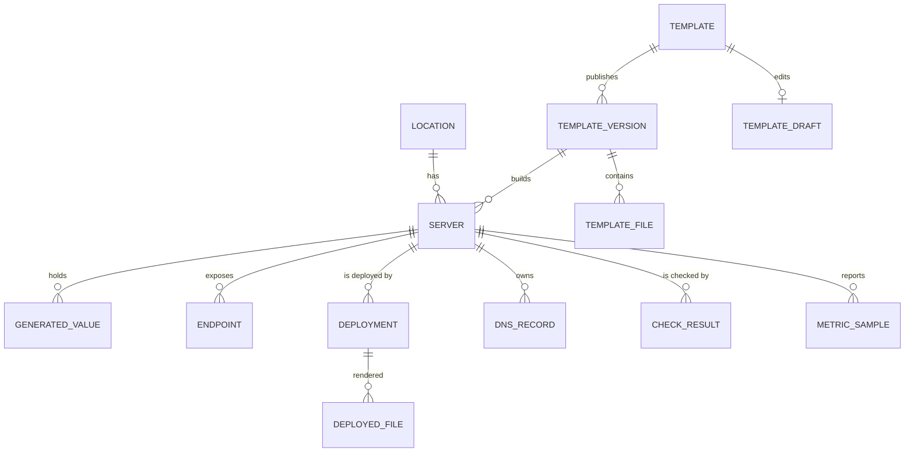
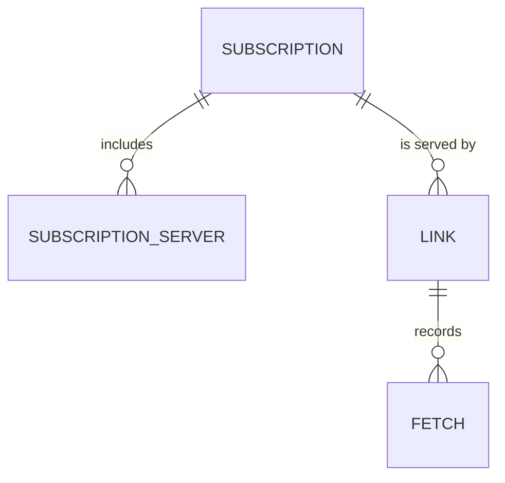
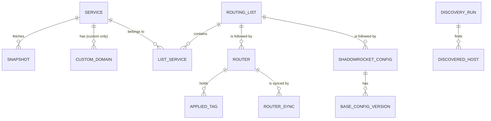

# Data model

This is the logical model: entities, their important fields and relations. The exact columns are settled in the build. Each module owns its tables. References across modules are plain IDs without foreign keys, cleaned up by events ([ADR 0002](./adr/0002-modules-talk-through-ports-and-events.md)). Fields marked 🔒 are encrypted at rest ([ADR 0012](./adr/0012-secrets-encrypted-root-password-never-stored.md)).

## Platform

| Entity | Important fields | Notes |
|---|---|---|
| **Admin** | username, password hash, language, created, password changed | Exactly one row in practice. |
| **Session** | id (stored hashed), admin, created, last seen, idle expiry, absolute expiry, IP, user agent | Ended by sign-out, password change, "sign out everywhere". |
| **Sign-in attempt** | IP, time, success | Feeds the lockout and the "new IP" notification. Kept 30 days. |
| **Setting** | key, value (🔒 when secret), updated | Typed, grouped by module. |
| **Known host** | address (`host:port`), key type, public key, fingerprint, first seen, accepted, subject (`server:12`, `router:3`, `jump:…`) | Pinned SSH host keys. |
| **Job** | id, queue, type, resource key, coalescing key, state, payload (secret parts 🔒), attempt / max attempts, run after, lease until, created by (admin / schedule / event), retry of, quiet, merged (count of merged requests), boot id, subject, started, finished, error | Coalescing key is unique per type. A clean quiet job (check rounds) is deleted after 24 h. |
| **Job step** | job, index, name, state, started, finished, error | Progress and resume. |
| **Job log line** | job, sequence, time, level, step, text (already redacted) | |
| **Event** | id, time, module, type, subject type + id, actor, payload | Append-only. |
| **Subscriber cursor** | subscriber name, last delivered event id | At-least-once delivery. |
| **Notification rule** | event type, enabled | Defaults come from [events.md](./events.md). A row exists only where the admin's choice differs from the default; setting it back deletes the row. |
| **Notification** | event, channel, language, message (JSON: emoji, title, body, link, button), state (queued / sent / failed), attempts, last error, job, sent at | The message is rendered when queued, in the admin's language. The event id has no foreign key: events can be pruned, the notification keeps its own text. Kept 90 days. |
| **Schedule** | name, enabled, next run, last run, last job, skips | Run-time state only. The interval or time of day is declared in code (a setting may override it), so it isn't stored. |

## Servers

| Entity | Important fields | Notes |
|---|---|---|
| **Location** | code (unique, `a-z`, 2–5 chars), display name, country code (for the flag) | E.g. `nl`, Netherlands, `NL` → 🇳🇱. |
| **Template** | slug (unique), name, description, default version, archived | |
| **Template draft** | template, manifest, files, based on version, updated | At most one per template. |
| **Template version** | template, number (1, 2, …), manifest, notes, published at | Immutable. |
| **Template file** | version, path, content, mode, validator | Paths relative, no `..`. |
| **Server** | location, number, name (unique forever), IP, SSH port, management hostname, proxy hostname, lifecycle state, template version, parameters, health state, health since, health detail, checks paused until, notes, created / activated / retired | |
| **Generated value** | server, key, value 🔒, pending 🔒, created, rotated | Kept for the server's life. Rotation puts the new value in `pending`; it replaces `value` only when the new ones passed the proxy test. Everything that serves a credential reads `value`. |
| **Endpoint** | server, key (stable across versions), endpoint type, host, port, params 🔒, display name, position | Refreshed on every deployment from the manifest's `endpoints`. |
| **Deployment** | server, kind (provision / redeploy / upgrade / params / rotate / restore / restart / images / reboot), template version, job, state, `uploaded`, started, finished | `uploaded` is 1 when the deployment uploaded files (it has deployed files). A server's **current files** are those of its latest succeeded deployment with `uploaded = 1`: a restart, an image update or a reboot uploads nothing and changes them not. |
| **Deployed file** | deployment, path, sha256, content 🔒 | Used to diff the next deployment. A deployment also keeps, sealed, the secret parameters and generated values its files were rendered with, so the Stack tab can mask an old deployment after a rotation. |
| **Rollout** | template, target version, state (running / done / stopped / cancelled), created / finished; items: server, position, version before, state (waiting / running / done / failed / skipped), job, parameters asked before the start (secret ones 🔒) | A rolling upgrade. One item runs at a time; an event subscriber starts the next. |
| **DNS record** | server, provider, zone, name, type, content, provider record id | Only records Proxier created. |
| **Check result** | server, endpoint (proxy tests), kind (self / proxy / external / reference), vantage point, time, ok, timings, detail | Retention 30 days. |
| **Metric sample** | server, time, load, CPU %, memory used/total, disk used/total, rx/tx bytes since the previous sample, uptime | Raw 7 days, hourly rollups 90 days. |

## Subscriptions

| Entity | Important fields | Notes |
|---|---|---|
| **Subscription** | name, title (shown in apps), description, default format, allowed formats, update interval (hours), hide unhealthy (on/off, which states, grace minutes), add new servers automatically, created | |
| **Subscription server** | subscription, server (ID from servers), position | Order is the order apps show. |
| **Link** | subscription, name, note, token 🔒 + token HMAC (unique), state (active / disabled / deleted), expiry, language, alert thresholds (override), alerts muted, created, disabled at, deleted at, last fetch | Deleted links keep their token for the tombstone period ([link lifecycle](./processes/subscriptions/link-lifecycle.md)). |
| **Fetch** | link, time, IP, network (IPv4 /24 or IPv6 /48), user agent, app, format, outcome (ok / stub-disabled / stub-expired / stub-deleted / stub-empty) | Retention 90 days. |

## Routing

| Entity | Important fields | Notes |
|---|---|---|
| **Catalog entry** | source, portal, selector, kind (v2fly list / iplist site / iplist group), group, site count, refreshed | Search. |
| **Catalog domain** | source, selector, domain, suffix or exact | Reverse index for discovery's catalog lookup. |
| **Service** | tag (unique), source, selector, portal, URL, display name, description, current snapshot, last checked, consecutive failures, last error | |
| **Snapshot** | service, fetched, status (accepted / rejected / superseded), rejection reason, suffix domains, exact domains, skipped entries, hash, counts | Rejected snapshots wait for "accept anyway". Older accepted ones are kept 90 days for diffs. |
| **Custom domain** | service, domain, suffix or exact, note | Custom services only. Each save also writes a snapshot. |
| **Routing list** | name, description, default | Exactly one default. |
| **List service** | list, service, position | Position breaks ties in domain ownership ([ADR 0013](./adr/0013-one-owner-service-per-domain.md)). |
| **Router** | name, routing list, state (awaiting setup / active / paused), host, SSH port, user, jump host (host, port, user), address-list name, DoH-forwarder name, RouterOS version, board, last sync, last sync result, last seen | |
| **Applied tag** | router, tag, domain hash, suffix and exact counts, applied at | What Proxier last installed. |
| **Router sync** | router, job, kind (sync / drift check), plan, result, error, time | |
| **Shadowrocket config** | name, routing list, token 🔒 + HMAC, state, rule policy (default `PROXY`), created, last fetch | |
| **Base config version** | config, number, content, created | |
| **Shadowrocket fetch** | config, time, IP, user agent | Retention 90 days. |
| **Discovery run** | input, registrable domain, via server (ID from servers), depth, state, job, suggestions, screenshots, created | Retention 30 days. |
| **Discovered host** | run, hostname, registrable domain, class (first-party / CDN / tracker / third-party / IP literal), requests, failed, already covered by | |

## Router scripts

| Entity | Important fields | Notes |
|---|---|---|
| **Router script** | slug, name, description, current version, archived | |
| **Router script draft** | script, body, based on version, updated | |
| **Router script version** | script, number, body, detected parameters, notes, published | Immutable. |
| **Generation** | version, router name, values (secret ones 🔒), link (ID from subscriptions), router (ID from routing), created | Immutable. |
| **Fetch URL** | generation, token HMAC, expires, used at, used IP, used user agent | Single use. |

## Retention

| Data | Kept |
|---|---|
| Events | forever (they are small; a prune setting exists) |
| Jobs and logs | 30 days; failed jobs 90 days |
| Check results | 30 days |
| Metric samples | raw 7 days, hourly 90 days |
| Fetches (links, Shadowrocket) | 90 days |
| Superseded snapshots | 90 days (the current one forever) |
| Discovery runs | 30 days |
| Sign-in attempts | 30 days |
| Backups | 14 daily snapshots |
