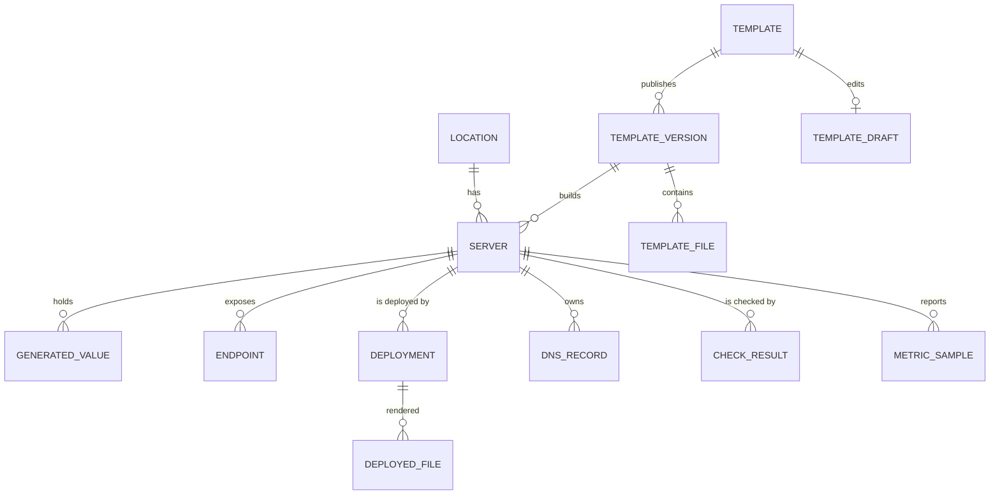
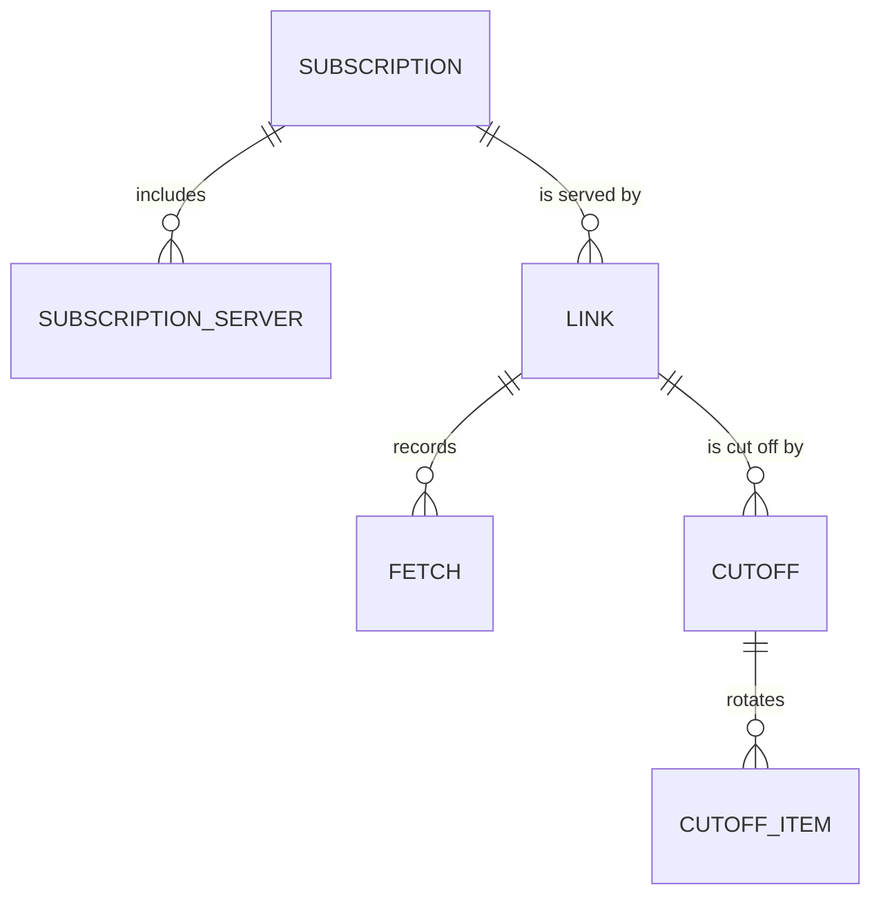
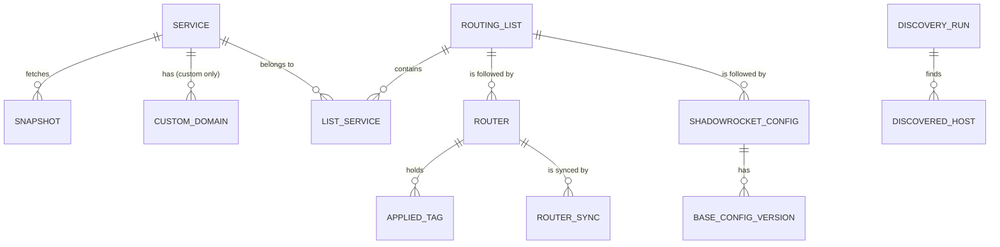

# Data model

This is the logical model: entities, their important fields and relations. The exact columns are settled in the build. Each module owns its tables. References across modules are plain IDs without foreign keys, cleaned up by events ([ADR 0002](./adr/0002-modules-talk-through-ports-and-events.md)). Fields marked 🔒 are encrypted at rest ([ADR 0012](./adr/0012-secrets-encrypted-root-password-never-stored.md)).

## Platform

| Entity | Important fields | Notes |
|---|---|---|
| **Admin** | username, password hash, language, created, password changed | Exactly one row in practice. |
| **Session** | id (stored hashed), admin, created, last seen, idle expiry, absolute expiry, IP, user agent | Ended by sign-out, password change, "sign out everywhere". |
| **Sign-in attempt** | IP, time, success | Feeds the lockout and the "new IP" notification. Kept 30 days. |
| **Setting** | key, value (🔒 when secret), updated | Typed, grouped by module. |
| **Known host** | address (`host:port`), key type, public key, fingerprint, first seen, accepted, subject (`server:12`, `router:3`, `jump:…`) | Pinned SSH host keys. |
| **Job** | id, queue, type, resource key, coalescing key, state, payload (secret parts 🔒), attempt / max attempts, run after, lease until, created by (admin / schedule / event), retry of, quiet, merged (count of merged requests), boot id, subject, started, finished, error | Coalescing key is unique per type. A clean quiet job (check rounds) is deleted after 24 h. |
| **Job step** | job, index, name, state, started, finished, error | Progress and resume. |
| **Job log line** | job, sequence, time, level, step, text (already redacted) | |
| **Event** | id, time, module, type, subject type + id, actor, payload | Append-only. |
| **Subscriber cursor** | subscriber name, last delivered event id | At-least-once delivery. |
| **Notification rule** | event type, enabled | Defaults come from [events.md](./events.md). A row exists only where the admin's choice differs from the default; setting it back deletes the row. |
| **Notification** | event, channel, language, message (JSON: emoji, title, body, link, button), state (queued / sent / failed), attempts, last error, job, sent at | The message is rendered when queued, in the admin's language. The event id has no foreign key: events can be pruned, the notification keeps its own text. Kept 90 days. |
| **Schedule** | name, enabled, next run, last run, last job, skips | Run-time state only. The interval or time of day is declared in code (a setting may override it), so it isn't stored. |

## Servers

| Entity | Important fields | Notes |
|---|---|---|
| **Location** | code (unique, `a-z`, 2–5 chars), display name, country code (for the flag) | E.g. `nl`, Netherlands, `NL` → 🇳🇱. |
| **Template** | slug (unique), name, description, default version, archived | |
| **Template draft** | template, manifest, files, based on version, updated | At most one per template. |
| **Template version** | template, number (1, 2, …), manifest, notes, published at | Immutable. |
| **Template file** | version, path, content, mode, validator | Paths relative, no `..`. |
| **Server** | location, number, name (unique forever), IP, SSH port, management hostname, proxy hostname, lifecycle state, template version, parameters, health state, health since, health detail, checks paused until, notes, created / activated / retired | |
| **Generated value** | server, key, value 🔒, pending 🔒, created, rotated | Kept for the server's life. Rotation puts the new value in `pending`; it replaces `value` only when the new ones passed the proxy test. Everything that serves a credential reads `value`. |
| **Endpoint** | server, key (stable across versions), endpoint type, host, port, params 🔒, display name, position | Refreshed on every deployment from the manifest's `endpoints`. |
| **Deployment** | server, kind (provision / redeploy / upgrade / params / rotate / restore / restart / images / reboot), template version, job, state, `uploaded`, started, finished | `uploaded` is 1 when the deployment uploaded files (it has deployed files). A server's **current files** are those of its latest succeeded deployment with `uploaded = 1`: a restart, an image update or a reboot uploads nothing and changes them not. |
| **Deployed file** | deployment, path, sha256, content 🔒 | Used to diff the next deployment. A deployment also keeps, sealed, the secret parameters and generated values its files were rendered with, so the Stack tab can mask an old deployment after a rotation. |
| **Rollout** | template, target version, state (running / done / stopped / cancelled), created / finished; items: server, position, version before, state (waiting / running / done / failed / skipped), job, parameters asked before the start (secret ones 🔒) | A rolling upgrade. One item runs at a time; an event subscriber starts the next. |
| **DNS record** | server, provider, zone, name, type, content, provider record id | Only records Proxier created. |
| **Check result** | server, endpoint (proxy tests), kind (self / proxy / external / reference), vantage point, time, ok, timings, detail | Retention 30 days. |
| **Metric sample** | server, time, load, CPU %, memory used/total, disk used/total, rx/tx bytes since the previous sample, uptime | Raw 7 days, hourly rollups 90 days. |

## Subscriptions

| Entity | Important fields | Notes |
|---|---|---|
| **Subscription** | name (unique, exact match), title (shown in apps), description, default format, allowed formats, update interval (hours), hide unhealthy (on/off, which states, grace minutes), add new servers automatically + since when it is on, when `all_unhealthy` was last raised, created | |
| **Subscription server** | subscription, server (ID from servers), server name (a copy made when it was added: names never change or get reused), position (dense 1…n), added | Order is the order apps show. A member the catalog no longer serves stays, "not in service", until its retirement removes it. |
| **Link** | subscription, name (unique among links that aren't deleted), note, token 🔒 + token HMAC (unique), state (active / disabled / deleted), expiry (the first moment it is expired), language, format override, alert thresholds (override), alerts muted, when it was last alerted / warned of expiry / told it expired, created, disabled at, deleted at, last fetch (time, app, network) | Deleted links keep their token for the tombstone period ([link lifecycle](./processes/subscriptions/link-lifecycle.md)) and hold their subscription until it ends; after that the token is erased and the subscription may be gone (no subscription). |
| **Fetch** | link, time, IP, network (IPv4 /24 or IPv6 /48), user agent, app, format, outcome (ok / stub-disabled / stub-expired / stub-deleted / stub-empty) | Retention: the `subscriptions.fetch_retention` setting (90 days). |
| **Network country** | network, country (empty when unknown), looked up | Looked up by the network's first address, once a month. |
| **Cut-off** / **cut-off item** | link, created, by / position, server (ID + name), state (waiting / running / done / failed / skipped), rotation job, error | One rotation at a time per cut-off. |

## Routing

| Entity | Important fields | Notes |
|---|---|---|
Tables `routing_*`, all written by the module's first migration ([3a](./build/3a.md#tables)); "Main" is inserted by it as the default list.

| Entity | Important fields | Notes |
|---|---|---|
| **Catalog source** | source (`v2fly`, `iplist:main`, `iplist:beta`, `iplist:russia`), generation in force, refreshed, revision (v2fly commit), entries, consecutive failures, failing since, last error, notified | Each source writes its rows as a new **generation** and then switches to it in one short transaction; only the generation in force is read. |
| **Catalog entry** | source, generation, kind (v2fly list / iplist site / iplist group), name (the tag), group (of a site), sites (of a group), domains (includes resolved) | Search. |
| **Catalog domain** | source, generation, name (list or site), domain, suffix or exact, attributes (v2fly) | Reverse index for discovery's catalog lookup. |
| **Catalog include** | generation, list, included list, filter (`@ads`, `@-cn`) | Names the lists that hold a domain through an include. |
| **Service** | tag (unique), source (`v2fly` / `iplist` / `url` / `custom`), selector (the stored spelling; empty for custom), name (custom), description, origin (custom: '' / discovery / import / router), last checked, last error, consecutive failures, failing notified | The accepted snapshot is found by its status, not stored here. |
| **Snapshot** | service, status (accepted / superseded / rejected), selector, portal and kind (iplist: site or group), suffix and exact names (sorted text, newline-joined), skipped entries (JSON), counts, hash, added / removed (against the accepted one before), rejection reason and percent lost, forced by, made by the daily round, dismissed, fetched, accepted | Exactly one accepted snapshot per service (a partial unique index). Snapshots are text, never one row per name. |
| **Custom domain** | service, domain (punycode), exact, note (≤ 200) | Custom services only. Each save that changes the names also writes a snapshot. |
| **Routing list** | name, description, default | Exactly one default. |
| **List service** | list, service, position (dense, 1..n), added | Position breaks ties in domain ownership ([ADR 0013](./adr/0013-one-owner-service-per-domain.md)). A service in a list can't be deleted. |
| **Router** | name, routing list, state (awaiting / active / paused / removing), host, port, user, jump host (host, port, user), first hop through the tailnet, address-list name, DoH-forwarder name, RouterOS version, board, connected, last seen, last sync (time, result, error), consecutive failures, failure notified, drift (tags, checked), unmanaged tags notified, untagged and infra-pin counts at the last read, awaiting until, created by | |
| **Applied tag** | router, tag, entries hash, suffix and exact counts, applied at | What Proxier last installed. |
| **Unmanaged tag** | router, tag, entries, names (JSON, ≤ 5 000), first and last seen, ignored | Tags on a router Proxier never installed. |
| **Router sync** | router, job, kind (sync / preview / drift / removal), trigger, state, failed step and hop, error, read at, plan (JSON), script (preview), added / updated / removed / unchanged / recorded counts, drift, times | |
| **Router test** | router (none for the add form), the connection tested, job, state (running / passed / warned / failed / confirm), checks (JSON), the key to confirm (hop, address, key, fingerprint), version, board, error, times | Test connection runs. |
| **Shadowrocket config** | name (also the file name), routing list, rule policy (default `PROXY`), token 🔒 + HMAC, enabled, created, last fetch (time, user agent) | |
| **Base config version** | config, number, content, note, created | |
| **Shadowrocket fetch** | config, time, IP, user agent | Retention 90 days. |
| **Import** | state (preview / running / done / failed), routing list, rows (JSON), ignored keys, fetched base config and its URL, Shadowrocket choice and outcome (JSON), job, times | Never the imported file's text. |
| **Discovery run** | input, URL visited, host, registrable domain, via (direct / server / auto), server (ID from servers, and its name), depth, state, job, title, suggestions (JSON), visits (JSON), capped, error, created, finished | Retention 30 days; screenshots are files under the data directory. |
| **Discovered host** | run, hostname, registrable domain, class (first-party / CDN / tracker / third-party / IP literal), requests, failure on the direct visit, the visits that saw it | |

## Router scripts

| Entity | Important fields | Notes |
|---|---|---|
| **Router script** | slug, name, description, current version, archived | |
| **Router script draft** | script, body, based on version, updated | |
| **Router script version** | script, number, body, detected parameters, notes, published | Immutable. |
| **Generation** | version, router name, values (secret ones 🔒), link (ID from subscriptions), router (ID from routing), created | Immutable. |
| **Fetch URL** | generation, token HMAC, expires, used at, used IP, used user agent | Single use. |

## Retention

| Data | Kept |
|---|---|
| Events | forever (they are small; a prune setting exists) |
| Jobs and logs | 30 days; failed jobs 90 days |
| Check results | 30 days |
| Metric samples | raw 7 days, hourly 90 days |
| Link fetches | `subscriptions.fetch_retention` (default 90 days), pruned by the expiry scan every 15 minutes |
| Network countries (of fetching networks) | 30 days; an unknown one (lookup off or failed) 1 day, so it is looked up again |
| Deleted links (tombstones) | the row forever; the token is erased once `subscriptions.tombstone` (default 30 days) has passed |
| Shadowrocket fetches | 90 days |
| Superseded snapshots | 90 days (the current one forever) |
| Discovery runs | 30 days |
| Sign-in attempts | 30 days |
| Backups | 14 daily snapshots |
| Deployments and deployed files of retired servers | kept (sealed, never shown); no pruning rule exists yet |
