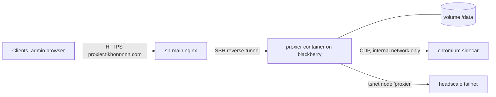

# Deployment

Proxier is deployed like the other self-hosted services: an image built by GitHub Actions, a compose file in the infra repo of the node that runs it, and a server block in the sh-main gateway. The image and CI live in this repository (`Dockerfile`, `.github/workflows/ci.yaml`). The compose file (`sh-blackberry/proxier.yaml`) and the gateway block (`sh-main/nginx/conf.d/proxier.conf`) were drafted in 0e; this document describes what they contain.

## Topology



- **blackberry** (home, Russia) runs the `proxier` and `chromium` containers. Its compose file is `sh-blackberry/proxier.yaml`, with env from the `secrets/` submodule.
- **sh-main** terminates TLS for `proxier.tikhonnnnn.com` and forwards everything through the existing SSH reverse tunnel, like `files.tikhonnnnn.com`: the sidecar `ssht-proxier` forwards `ssh-server:10005` to `proxier:8080`. nginx sends `X-Real-IP` and `X-Forwarded-For`, its body size limit fits uploads up to 10 MB (template imports), and it does not buffer responses and waits up to an hour on one, because the live job log is a server-sent event stream.
- **The trusted proxy.** Proxier takes the client address from `X-Real-IP` only when the TCP peer is in `PROXIER_TRUSTED_PROXIES`. The compose file gives the `proxier` network a fixed subnet (`10.89.250.0/29`); its only other member is the tunnel sidecar, so that subnet is the value. Without it every client would look like the tunnel, and the sign-in lockout and the "new IP" check would be useless.
- **headscale** (on sh-main) gets a new node, `proxier`, joined with a pre-auth key ([ADR 0008](./adr/0008-tsnet-node-for-router-reachability.md)). headscale ACLs decide which jump hosts and routers that node may reach.

## Containers

| Container | Image | Notes |
|---|---|---|
| `proxier` | `ghcr.io/tikhonp/proxier` | `read_only`, `cap_drop: ALL`, `no-new-privileges`, non-root user (65532), `/data` bind mount owned by that user, `tmpfs /tmp`, no published ports (the tunnel reaches it on the compose network). No Docker socket ([ADR 0009](./adr/0009-embedded-xray-core-no-docker-socket.md)). Healthy when `proxier healthcheck` (the image has no curl) gets 200 from its own `/healthz`. |
| `ssht-proxier` | `jnovack/autossh` | The reverse tunnel to sh-main, like every other service's. |
| `chromium` | `chromedp/headless-shell` (pinned tag) | Internal network only, no volume, memory limit (1 GB). It reaches the internet directly or through Proxier's discovery SOCKS listener. Optional: without it, discovery runs catalog lookup only. |

The image bundles what the file validators need besides the Go libraries: an `nginx` binary for `nginx -t` and `bash` for `bash -n`. Both run on files in a temporary directory ([template authoring](./processes/servers/template-authoring.md#validation)).

## Images and CI

Same pattern as vk2tg and alcs:

- `ci.yml` on every push and PR: `go build`, `go vet`, `go test -race`, golangci-lint, govulncheck. A failure withholds the image.
- `docker.yml` (or an `image` job after tests) on `main` and tags: buildx, `linux/amd64` (blackberry is x86-64), pushed to `ghcr.io/tikhonp/proxier` as `:<sha>`, `:<branch>`, `:latest` for `main` and `:<tag>` for releases. `APP_VERSION` is set to `<ref>-<sha>`.
- Dozzle's nightly update (04:00, label `dev.dozzle.update=auto`) updates the container, as it does for the other services.

## The `/data` volume

```
/data/proxier.db (+ -wal, -shm)   the database
/data/backups/                    nightly snapshots, proxier-YYYY-MM-DD.db, the newest 14
/data/tailnet/                    the tailnet node's state (only once the tailnet is on)
```

The directory is created by the image owned by uid 65532; a bind mount on the host must be made the same way (`sudo install -d -o 65532 -g 65532 -m 700 ~/.local/share/proxier`). The tailnet state is not in the database or its snapshots.

## First start

1. Generate the master key (`openssl rand -base64 32`) and keep it in the secrets submodule **and** in Vaultwarden. Without it the database's secrets can't be recovered.
2. Start the container. Migrations run on startup. Proxier generates its SSH key pair (ed25519) and creates the default routing list "Main" and the default location set.
3. `docker exec -it proxier /bin/proxier manage create-admin` creates the admin interactively. It's the only way to create one.
4. Sign in, then in Settings: the Cloudflare API token and zones, the Telegram bot (token + detected chat), your personal SSH public keys (installed on every new server), the hostname pattern (default `{location}-{number}.hosts.tikhonnnnn.com`), check-host nodes, and the time zone and languages.
5. Copy Proxier's public SSH key (Settings → SSH) onto the jump hosts and routers you want to sync.

What the admin does by hand, once: create the DNS record for `proxier.tikhonnnnn.com` and issue its certificate (`make proxier.tikhonnnnn.com` in sh-main); create the data directory with the right owner; put `PROXIER_MASTER_KEY` (and a headscale pre-auth key for the node `proxier`, `PROXIER_TS_AUTHKEY`) into `secrets/blackberry/proxier.env` and the master key into Vaultwarden; allow the node `proxier` to reach the jump hosts and routers in headscale's ACL (stored in its database: edit it in Headplane); commit both infra repos; push the image.

## Backups

- Every night at 03:30 (Settings → Backups changes the time and the count) Proxier writes a consistent snapshot of the database (`VACUUM INTO`, on a connection of its own, so writes go on meanwhile) to `/data/backups/proxier-YYYY-MM-DD.db` and keeps 14. A file appears only when whole: it is written under a temporary name and renamed. blackberry's existing backup rsyncs `/data/backups` (not the live database, whose copy would not be consistent) to the backup disk at 03:45, and from there to sh-apple.
- Settings → Backups → **Back up now** queues a snapshot at once; **Download latest** gives the newest. Its secrets are still encrypted: restoring needs the same master key.
- Restoring means stopping the container, putting the snapshot in place as `proxier.db`, and starting it.

## Operating notes

- **Home internet down** means the admin UI and every link URL are unreachable. Client apps keep their last list, so existing connections are unaffected. Checks pause their verdicts (reference check), so coming back online doesn't raise false alarms.
- **Upgrades** are image updates. Migrations run on startup, and a migration failure keeps the old schema and exits. Running jobs are interrupted by the restart and resume ([jobs](./processes/platform/jobs.md)).
- **Losing the master key** loses every secret: generated values, tokens, the Cloudflare and Telegram tokens, Proxier's SSH key. Servers keep running, but Proxier can't manage them, and link URLs would need new tokens.
- **Moving the public host** (a new `PROXIER_BASE_URL`) changes every link URL. Keep the old name pointing at Proxier until the apps have refreshed from the new URLs. Give people the new URLs first.
