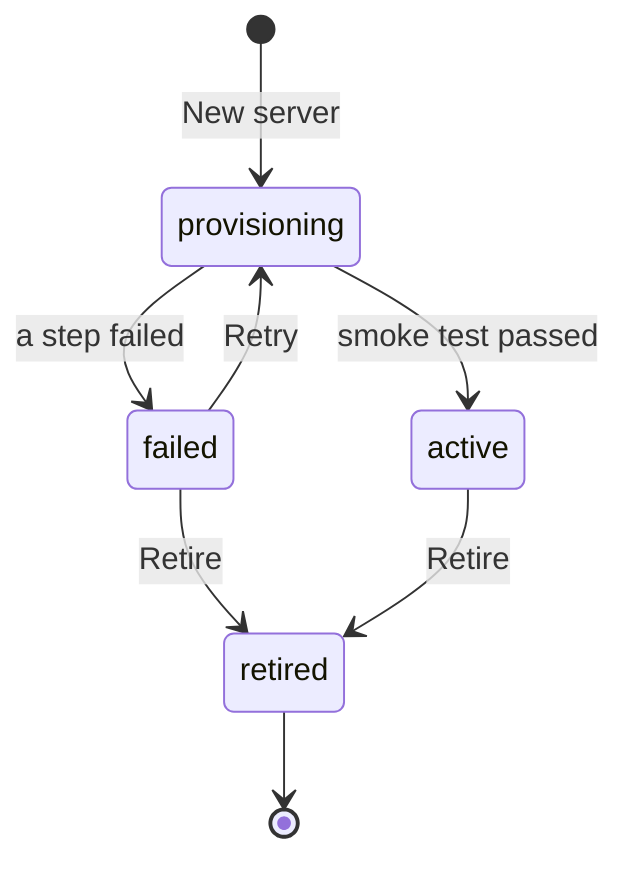

# Servers

The servers module turns a freshly issued VPS into a working proxy server from a versioned **template**. Afterwards it keeps the server's DNS, stack and secrets, can change the server later, and watches whether the server works from Russia. It replaces `servers-templates/proxy/setup.sh`, manual DNS, `credentials.txt`, and finding out about blocks from complaints.

## Locations and names

- A **location** is a short code (`a-z`, 2–5 characters) with a display name and a country (for the flag): `nl`, Netherlands, 🇳🇱. Locations are managed under Servers → Locations. A location that has servers can't be deleted.
- A new server gets the **server name** `<location>-<number>`, where the number is one more than the highest number that location has ever used. Numbers are **never reused**, not even after a failed provisioning or a retirement. A name means one server for good.
- The **management hostname** comes from the hostname pattern in Settings, default `{location}-{number}.hosts.tikhonnnnn.com` → `nl-1.hosts.tikhonnnnn.com`.
- The **proxy hostname** is the name in connection URIs and the TLS certificate. In the first version it is always the management hostname. The two are separate fields so that proxy hostnames on other domains can come later without migrating data ([DNS](#dns)).
- When the admin pastes an IP into the new-server form, Proxier looks up the IP's country and preselects the matching location. It is only a suggestion.

## Templates

A **template** is a named definition of a server's stack. Templates are stored in Proxier, edited in the UI, versioned, and validated when published ([ADR 0003](../adr/0003-proxier-rendered-stack-templates.md)). Proxier generates the secrets, renders every file and runs every step itself. It always knows the server's real configuration, so it can redeploy, upgrade and rotate later.

A **template version** is a **manifest** (`manifest.yaml`) plus files. Versions are immutable and numbered 1, 2, 3… Editing happens in a **draft** based on the latest version, and publishing the draft creates the next version. Each template has a **default version** used for new servers. A newer version never touches existing servers by itself: they show "update available" until the admin upgrades them.

Lifecycle and validation: [template authoring](../processes/servers/template-authoring.md).

### Manifest

The seed template, converted from `servers-templates/proxy` ([VLESS XHTTP integration](../integrations/vless-xhttp.md)), shows every part:

```yaml
name: VLESS XHTTP behind nginx
description: VLESS over XHTTP, hidden behind nginx with a Let's Encrypt certificate and a decoy site.

requires:
  os: [debian-12, debian-13, ubuntu-22.04, ubuntu-24.04]
  arch: [amd64, arm64]
dir: /opt/proxier/vless-xhttp        # where the stack lives on the server
ports: [80/tcp, 443/tcp]             # opened in the firewall, besides SSH

parameters:                          # asked when building a server
  - key: letsencrypt_email
    label: Let's Encrypt email
    type: email
    required: false
    sample: admin@example.com        # used by validation

generated:                           # created once per server, reused on every redeploy
  - { key: client_uuid, kind: uuid, rotate: true }
  - { key: xhttp_path, kind: hex, length: 16, prefix: /, rotate: true }
  - { key: container_postfix, kind: hex, length: 4 }

files:                               # rendered with Go templates, uploaded into dir
  - { path: compose.yaml, validate: compose }
  - { path: xray-config.json, validate: xray }
  - { path: nginx/default.conf.template, validate: nginx }
  - { path: site/index.html }
  - { path: .env, mode: "0600" }
  - { path: issue-cert.sh, mode: "0755", validate: shell }

steps:
  install:                           # provisioning
    - base-bootstrap
    - upload-files
    - run: ./issue-cert.sh
      timeout: 5m
    - compose-up: { pull: true }
    - wait-http: { url: "https://{{ .Server.ProxyHostname }}/", resolve: 127.0.0.1, status: 200 }
  redeploy:                          # redeploy, upgrade, rotation
    - upload-files
    - compose-up
  uninstall:                         # retirement with "remove the stack"
    - compose-down: { volumes: true }

endpoints:                           # what clients connect to
  - key: main                        # stable across versions; subscriptions rely on it
    type: vless-xhttp-tls
    host: "{{ .Server.ProxyHostname }}"
    port: 443
    credential: "{{ .Gen.client_uuid }}"
    params:
      path: "{{ .Gen.xhttp_path }}"
      sni: "{{ .Server.ProxyHostname }}"
      mode: stream-up
      fp: chrome
      alpn: h2

checks:                              # the self-check
  - compose-running
  - http-local: { url: "https://{{ .Server.ProxyHostname }}/", status: 200 }
  - cert-expiry: { file: "certbot/conf/live/{{ .Server.ProxyHostname }}/fullchain.pem" }
  - disk-free

proxy_test:                          # optional; overrides Settings → Servers → proxy test URL
  url: "https://speed.cloudflare.com/__down?bytes=262144"
```

**Parameters** have a `key`, `label`, `type` (`string`, `email`, `int`, `bool`, `choice` with `options`, `text`), optional `required`, `default`, `sample`, `help`, and `secret` (stored encrypted, masked in the UI).

**Generated values** have a `key` and a `kind`: `uuid` (v4), `hex` (`length` characters), `base64` (`bytes`), or `password` (`length`, letters and digits). Each can have a `prefix`. `rotate: true` marks the values that rotation replaces. They are created on first use for a server and kept for the server's life. Upgrading to a version that declares a new one creates it. A value no longer declared is kept, unused, so a rollback still works.

**Files** have a `path`, an optional `mode` (default `0644`) and an optional `validate` (`xray`, `compose`, `nginx`, `json`, `yaml`, `shell`). A path is relative and `/`-separated, with no `..`, no leading `/` and no `./`, at most 255 bytes, and only `A-Z a-z 0-9 . _ - /` (paths end up in shell commands and SFTP paths). A file in the template that `files` does not list is an error, except `manifest.yaml`. A file is at most 1 MiB, and a version at most 10 MiB, counted on the files as written (before rendering).

**Steps** are lists for `install`, `redeploy` and `uninstall`. `install` must start with `base-bootstrap`, then `upload-files`, and `redeploy` must start with `upload-files`; neither kind may appear anywhere else, nor in `uninstall`. The provisioning and deploy jobs run those as steps of their own (with DNS and the generated values in between during provisioning), so their place is fixed. A `run` step whose command starts with `./` must name a file listed in `files` (`./issue-cert.sh` needs `issue-cert.sh`). Built-in step kinds:

| Step | What it does |
|---|---|
| `base-bootstrap` | Works as the `proxier` deploy user that provisioning created (passwordless sudo, Proxier's and your personal SSH keys). Turns off password login and root login over SSH. Writes `.hushlogin`, installs the apt prerequisites `curl ca-certificates openssl ufw` (waiting for apt's lock, which a fresh VPS often holds), and installs Docker (get.docker.com) if missing. Turns on the firewall (ufw) with the SSH port plus `ports`. Docker's published ports bypass ufw; the manifest's ports are opened in ufw anyway so the rule set says what is meant, and nothing else listens. Never locks Proxier out: each SSH change is verified with a fresh key login and rolled back if that fails. |
| `upload-files` | Renders every file and uploads each one to a temporary name before renaming it into place, so no file is half-written. Deletes files that an earlier deployment of this server put there and this version no longer has. Never touches anything else in `dir` (runtime data such as `certbot/`). |
| `run` | Runs a command or a bundled script in `dir`, with a timeout (default 10 min). Exit code 0 is success. Output goes to the job log. |
| `compose-up` | `docker compose up -d --remove-orphans`, with `pull: true` pulling images first. |
| `compose-down` | `docker compose down`, with `volumes: true` adding `-v`. |
| `wait-http` | Polls a URL until it answers with the expected status (default timeout 2 min). With `resolve`, the request runs on the server through `curl --resolve`. |

**Endpoints** declare what clients connect to: a stable `key`, an endpoint `type`, `host`, `port`, `credential` and type-specific `params`. They are rendered on every deployment and stored, so subscriptions always serve current values.

**Checks** are the self-check, run over SSH every 5 minutes:

| Check | Passes when |
|---|---|
| `compose-running` | Every compose service is running, and healthy if it declares a healthcheck. |
| `http-local` | The URL, requested on the server itself (`curl --resolve`), returns the status. |
| `cert-expiry` | The certificate exists. Fewer than 14 days left raises `server.cert_expiring` but doesn't fail the check. An expired certificate fails it. |
| `disk-free` | More than 10 % of the root filesystem is free (below that, `server.disk_low`). Under 2 % fails the check. |
| `run` | A custom command exits 0. |

### Rendering

Files, step arguments, endpoint fields and check arguments are Go templates. Missing keys are errors. The context is:

| Name | Example |
|---|---|
| `.Server.Name`, `.Server.Number` | `nl-1`, `1` |
| `.Server.Location.Code`, `.Name`, `.Country` | `nl`, `Netherlands`, `NL` |
| `.Server.IP`, `.Server.SSHPort` | `203.0.113.10`, `22` |
| `.Server.ManagementHostname`, `.Server.ProxyHostname` | `nl-1.hosts.tikhonnnnn.com` |
| `.Params.<key>` | parameters |
| `.Gen.<key>` | generated values |
| `.Clients` | the client identities the stack must accept: a list of `{ID, Name}`. In the first version it holds exactly one entry, the endpoint credential named `shared`. |
| `.Template.Slug`, `.Template.Version` | `vless-xhttp`, `3` |

Functions: `json`, `quote`, `default`, `lower`, `upper`, `trim`, `urlquery`, `b64enc`, `sha256`, `join`, `indent`.

### Future: per-link credentials

The first version shares one credential per endpoint ([ADR 0004](../adr/0004-one-shared-credential-per-endpoint.md)). Templates still render xray's client list from `.Clients` rather than from `.Gen.client_uuid` directly:

```json
"clients": [{{ range $i, $c := .Clients }}{{ if $i }},{{ end }}{ "id": {{ json $c.ID }}, "email": {{ json $c.Name }} }{{ end }}]
```

If per-link (or per-subscription) credentials ever arrive, Proxier only has to fill `.Clients` with more entries and redeploy. Templates written this way keep working.

### Import and export

- **Export** a version as a zip: `manifest.yaml` and its files, with the same layout as the editor.
- **Import** a zip, or a git URL with a path and ref (e.g. `github.com/tikhonp/servers-templates`, `proxy-proxier/`, `master`). Either way the result is a new draft, and it goes through validation like any edit. This keeps `servers-templates` usable as the backup and review place for templates.
- The **seed template** "VLESS XHTTP behind nginx" is created on first start, once (deleting it later does not bring it back). Its images stay `:latest`, so it is published with the two warnings that causes; **Update images** pulls new versions.

## Lifecycle



- **provisioning**: the provisioning job is queued or running ([provisioning](../processes/servers/server-provisioning.md)).
- **active**: built and verified. Health checks run, and the server can be added to subscriptions.
- **failed**: provisioning stopped at a step. The server page shows the step, the error and the log, with **Retry** and **Retire**.
- **retired**: out of service for good, kept for history ([retirement](../processes/servers/server-retirement.md)). It can't be brought back; build a new server instead.

Only **active** servers have a health state ([health](../processes/servers/server-health.md)): healthy, degraded, blocked, down, unknown or paused.

## Server page

- **Overview**: flag and name, health badge with "since" and a one-sentence reason, lifecycle state, IP, hostnames, location, template and version (with "update available"), endpoints with their connection URIs (copy, QR, reveal), the subscriptions it is in, notes, and recent events.
- **Health**: the latest result of each check per vantage point, as a matrix, plus the verdict explanation and a timeline of health states ([health](../processes/servers/server-health.md)).
- **Stats**: CPU, memory, disk and traffic charts for 24 h / 7 d / 30 d, and container states ([stats](../processes/servers/server-stats.md)).
- **Stack**: the rendered files of the last deployment (secrets masked until revealed), its template version, and the deployment history with diffs.
- **Jobs** and **Activity**: filtered to this server.

Actions:

| Action | Allowed when | What happens |
|---|---|---|
| Retry | failed | Resumes provisioning from the failed step. Asks for the root password again if it failed before Proxier's key was installed. |
| Activate anyway | failed, only the smoke test failed | Makes the server active without a passing proxy test, after a confirmation. Health then comes from the checks, usually `blocked` ([provisioning](../processes/servers/server-provisioning.md#steps--after-a-failure)). |
| Redeploy | active | Re-renders the current version. Shows the diff, then applies it ([redeploy](../processes/servers/server-redeploy.md)). |
| Upgrade | active, newer version exists | Renders the chosen version. Asks for any new parameters, shows the diff, then applies it. |
| Edit parameters | active | Changes parameters, then redeploys. |
| Rotate credentials | active | Replaces the rotatable generated values and redeploys ([rotation](../processes/servers/credential-rotation.md)). |
| Restart stack | active | `docker compose restart`, then a self-check. |
| Update images | active | `docker compose pull` + `up -d`, then a self-check and proxy test. |
| Container logs | active, failed | Shows the last 200 lines of each compose service (a read-only job). |
| Reboot | active | Reboots, waits for SSH, then runs a check round. |
| Run checks now | active | Runs a full check round right away. |
| Pause checks / Resume | active | Health becomes `paused` for 1 h, 6 h, 24 h or until resumed. No notifications meanwhile. |
| Edit notes | any | — |
| Retire | provisioning, failed, active | Type the server name to confirm ([retirement](../processes/servers/server-retirement.md)). |

There is no rename, no location change and no IP change: the name is the identity.

## Server list

Columns: name with flag, health badge and since when, lifecycle state (when not active), IP, proxy hostname, template version (with "update available"), last proxy test latency, CPU / memory / disk mini-bars, traffic today, number of subscriptions. Filters: lifecycle state (default: everything but retired), health state, location, template. Bulk actions: **Run checks now**, **Upgrade to default version** (rolling, see [redeploy](../processes/servers/server-redeploy.md)), **Pause checks**.

## Endpoints and connection URIs

The first endpoint type is `vless-xhttp-tls`. Given an endpoint, it builds the connection URI exactly as `setup.sh` printed it ([VLESS XHTTP integration](../integrations/vless-xhttp.md)), and it runs the proxy test.

The **display name** of an endpoint (the `#fragment` apps show) is `{flag} {location name} {number}`, e.g. `🇳🇱 Netherlands 1`. A server with several endpoints adds the endpoint key: `🇳🇱 Netherlands 1 · main`. Until Phase 2 the location name is the one the admin entered (one language); translations of location names will follow the link's language once links have one.

## DNS

DNS is a driver; the first one is Cloudflare ([Cloudflare integration](../integrations/cloudflare.md)).

- Provisioning creates an **A record** for the management hostname (and for the proxy hostname, once they differ) pointing to the server's IP. It is **DNS-only, never proxied**: clients and Let's Encrypt must reach the server directly. TTL is 60 s, and the record carries the comment `proxier:<server name>`.
- Proxier only ever changes or deletes records that carry its comment. A different record already at that name stops provisioning with a conflict, unless the admin confirms an overwrite.
- After writing, Proxier waits until 1.1.1.1 and 8.8.8.8 both return the IP (timeout 10 min) before anything needs the name, for example the certificate. It asks them over DNS-over-HTTPS, and over plain UDP port 53 only when DoH cannot be reached, because the home router may intercept port 53.
- Retirement deletes the records, if they still point to the server's IP.
- **Accepted risk in the first version:** each server's certificate names its hostname, and every certificate is published in certificate-transparency logs. Anyone, including a censor, can list `*.hosts.tikhonnnnn.com` on crt.sh. The planned fix is to issue wildcard certificates centrally through Cloudflare DNS-01 and upload them to servers, optionally with proxy hostnames on unlinked cover domains ([roadmap](../roadmap.md#later)). Management and proxy hostnames are already separate fields, so no data migration is needed.

## Health and stats

Summarised here, defined in the process docs:

- **Checks**: the self-check over SSH (5 min), the proxy test from home through every endpoint (5 min), check-host.net TCP checks from Russia and abroad (30 min and on demand), and the reference check of home's own internet access.
- **Verdict** rules and flap protection: [health](../processes/servers/server-health.md). Subscriptions can hide unhealthy servers (per subscription).
- **Stats**: collected in the same SSH session as the self-check ([stats](../processes/servers/server-stats.md)).

## Ports for other modules

| Port | Used by | Contract |
|---|---|---|
| `EndpointCatalog` | subscriptions | Active servers with their endpoints (display name, type, host, port, credential, params), health state and "since". Changes arrive as events (`server.activated`, `server.redeployed`, `server.credentials_rotated`, `server.health_changed`, `server.retired`). |
| `ServerHostnames` | routing | Every management and proxy hostname and IP of every non-retired server. Routing refuses to route them. |
| `ProxyDialer` | routing (discovery) | A local SOCKS listener (or a dial function) that sends traffic through a chosen active server's endpoint. |

## Events

`template.*`, `location.created`, `server.*`, `health.*`: see [events](../events.md#servers).
