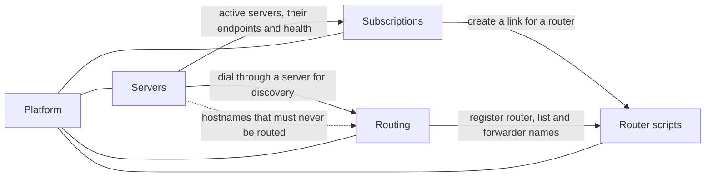

# Overview

## The problem

The proxy setup works today, but every part of it is manual and lives in a different place:

| Today | Pain |
|---|---|
| A fresh VPS gets `servers-templates/proxy/setup.sh` piped into bash. It asks for the domain, email and link name interactively, and prints a `vless://` link into `credentials.txt`. DNS records are created by hand. | Every server is a manual session. Nothing remembers which servers exist, how they were built, or their secrets. Changing a server after setup means SSH and editing by hand. |
| Connection links are copied out of `credentials.txt` and sent to people one by one. | There's no list of who has access to what. Adding a server means re-sending links. Taking access away means rebuilding the server. |
| Nothing watches the servers. | You find out a server is blocked or dead when someone complains. |
| `mtvpn.py` (CLI) fills the MikroTik address list from v2fly/iplist/URL sources over SSH. It renders the Shadowrocket config and uploads it to copyparty. The service lists live as text files on copyparty. | It only runs when you run it. Upstream list changes reach routers only after a manual `update`. Finding a new site's domains is guesswork. |
| `fresh-router.rsc` is edited by hand for every new router. | The current version and its parameters live in your head and in git history. |

**Proxier** replaces all of this with one always-on service: a web UI for the admin, background jobs for the long work, and public URLs for client apps, routers and phones.

## Who uses it

- **The admin** (you) is the only person who signs in. You do everything from the web UI, on desktop or phone, and get Telegram notifications.
- **Link holders** (family, friends, your own devices) never sign in and never see Proxier. They only see what their app receives from their link: the connection URIs, a title and an expiry date.
- **Routers** are MikroTiks that Proxier reaches over SSH (directly or through a tailnet jump host) to keep their domain lists in sync. A new router downloads its filled-in setup script from a fetch URL.
- **Shadowrocket** on the phone subscribes to a hosted config URL.

## Modules

Proxier is one service made of separate modules. Each can be swapped or extended without rewriting the others ([ADR 0002](./adr/0002-modules-talk-through-ports-and-events.md)).

| Module | Purpose | Key flows |
|---|---|---|
| **Platform** | What every module stands on: sign-in, settings, secrets, jobs and the scheduler, events and history, Telegram notifications, SSH, tailnet, two languages, backups. | [sign-in](./processes/platform/sign-in.md), [jobs](./processes/platform/jobs.md), [notifications](./processes/platform/notifications.md) |
| **Servers** | Turn an IP and root password into a working proxy server from a versioned template. Keep its DNS, stack and secrets. Check from home and from abroad whether it works or is blocked. Show its resources. | [template authoring](./processes/servers/template-authoring.md), [provisioning](./processes/servers/server-provisioning.md), [redeploy](./processes/servers/server-redeploy.md), [rotation](./processes/servers/credential-rotation.md), [health](./processes/servers/server-health.md), [stats](./processes/servers/server-stats.md), [retirement](./processes/servers/server-retirement.md) |
| **Subscriptions** | Group servers into subscriptions. Give each person or device a link to one subscription. Serve the connection URIs at that link, with expiry and shared-link alerts. | [subscription management](./processes/subscriptions/subscription-management.md), [link lifecycle](./processes/subscriptions/link-lifecycle.md), [fetch](./processes/subscriptions/subscription-fetch.md), [shared-link alerts](./processes/subscriptions/shared-link-alerts.md) |
| **Routing** | Everything mtvpn does, always on: services from v2fly, iplist, URLs and custom lists; search; discovery of a site's domains; routing lists; router sync with drift repair; the hosted Shadowrocket config. | [catalog search](./processes/routing/catalog-search.md), [services](./processes/routing/service-management.md), [discovery](./processes/routing/domain-discovery.md), [upstream refresh](./processes/routing/upstream-refresh.md), [routing lists](./processes/routing/routing-lists.md), [router sync](./processes/routing/router-sync.md), [Shadowrocket](./processes/routing/shadowrocket-config.md), [mtvpn import](./processes/routing/mtvpn-import.md) |
| **Router scripts** | Keep `fresh-router.rsc` in versions and fill in its parameters for a new router. Optionally create the router's subscription link and register it for sync. Serve the result at a one-time fetch URL. | [versions](./processes/router-scripts/script-versions.md), [generation](./processes/router-scripts/script-generation.md) |

How they connect:

## Goals of the first version

1. A fresh VPS becomes an active, verified proxy server from the UI. Nothing to type over SSH, and nothing to do in DNS by hand.
2. Templates are versioned, editable in the UI, validated when published, and checked by a smoke test after every provisioning.
3. Every server is checked continuously: on the server, through a real proxy connection from home, and from check-host.net nodes inside and outside Russia. A change of verdict reaches Telegram.
4. Every person or device has its own named link. Links are organised by subscription, can expire, and raise an alert when they look shared.
5. mtvpn and the copyparty uploads are retired: routers and the Shadowrocket config follow routing lists automatically, with safety checks on upstream changes.
6. A new site's domains can be found by typing its address.
7. A new router is set up from a filled-in, versioned `fresh-router.rsc` that it fetches itself.
8. The UI speaks English and Russian.

## Non-goals (first version)

Explicitly out of scope. Some are in the [backlog](./roadmap.md#later):

- More than one admin, roles, or anything multi-tenant. Selling access, payments, traffic accounting.
- Per-link credentials on servers. Credentials are shared per endpoint ([ADR 0004](./adr/0004-one-shared-credential-per-endpoint.md)).
- Ordering, paying for or cancelling VPSes through provider APIs. Billing and renewal reminders.
- Adopting servers that weren't built by Proxier. Replacing a blocked server while keeping its identity.
- Probe agents on other machines.
- Endpoint types other than VLESS over XHTTP with TLS.
- IP ranges in services (domains only). Routing targets other than MikroTik and Shadowrocket.
- Managing a router beyond its tunneled-domain list (DHCP, VLANs, firewall).
- Two-factor sign-in (the sign-in is built so it can be added).
- A browser page for links (QR codes, app buttons), and formats other than the URI list.
- HAR import and subdomain search in discovery.
- Telegram bot commands. The bot only sends.

## Assumptions and constraints

- The blocking Proxier must detect is Russian. Home (where Proxier runs) is in Russia, so Proxier itself is a Russian vantage point ([ADR 0005](./adr/0005-home-is-the-russian-vantage-point.md)).
- Proxier runs on the home server (blackberry) behind the sh-main gateway, like the other self-hosted services. The admin UI and the public URLs share one public host with password sign-in ([ADR 0006](./adr/0006-one-public-host-for-admin-and-public-urls.md)).
- DNS is Cloudflare. Notifications are Telegram. Servers run Debian or Ubuntu with Docker.
- Go, Docker, GitHub Actions building images, SQLite ([ADR 0001](./adr/0001-single-binary-sqlite-in-process-jobs.md)). The UI is server-rendered with templ and htmx ([ADR 0014](./adr/0014-server-rendered-ui-templ-htmx.md)), from the [design](./ui/design/README.md).
